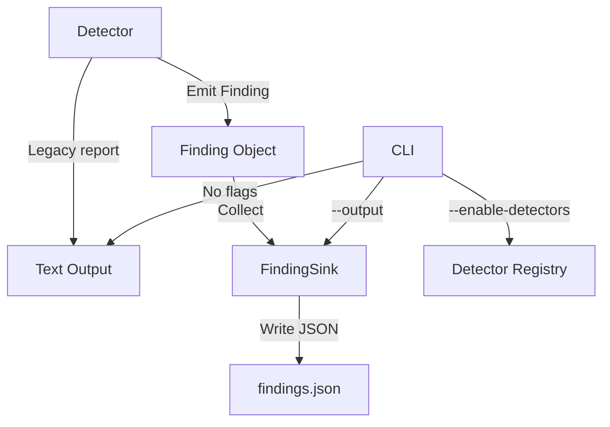

# Phase D: Output + CLI Plumbing

## Overview

This phase implements structured findings output and CLI configuration while maintaining backward compatibility with existing detectors. This is the foundation for subsequent phases (B, C, A, E).

## Architecture



## Implementation Plan

### 1. Create Finding Data Structure

**File:** [`manticore/ethereum/finding.py`](../manticore/ethereum/finding.py)

**Requirements:**
- Type-safe dataclass with all required fields
- Stable ID generation via hash of (kind + address + data + pc)
- `to_dict()` method for JSON serialization
- Support for optional fields (tx_index, chain_id, workspace_path, tags)

**Fields:**
```python
@dataclass
class Finding:
    kind: str                    # Vulnerability classification
    description: str              # Human-readable explanation
    severity: str                # "CRITICAL", "HIGH", "MEDIUM", "LOW"
    address: int                  # Target contract address
    sender: Optional[int]          # Attacker address (concrete)
    data: str                     # Hex-encoded calldata
    value: int                    # ETH value sent
    pc: int                       # Program counter at failure
    tx_index: Optional[int]        # Transaction index
    chain_id: Optional[int]         # Chain identifier
    workspace_path: Optional[str]    # Path to workspace
    tags: List[str]                # Additional metadata tags
```

### 2. Create FindingSink

**File:** [`manticore/ethereum/finding.py`](../manticore/ethereum/finding.py)

**Requirements:**
- Thread-safe collection of Finding objects
- Write JSON array to specified path
- Support both JSON and text output modes
- Maintain backward compatibility

**Methods:**
```python
class FindingSink:
    def __init__(self, output_path: Optional[str] = None)
    def add_finding(self, finding: Finding) -> None
    def write_json(self) -> None
    def get_findings(self) -> List[Finding]
```

### 3. Update ExploitDetector Base Class

**File:** [`manticore/ethereum/exploit_detectors.py`](../manticore/ethereum/exploit_detectors.py)

**Requirements:**
- Add `self.findings: List[Finding]` attribute
- Maintain existing `self.report()` method for backward compatibility
- Add new `emit_finding()` method for structured output
- Do not modify existing detectors

**Changes:**
```python
class ExploitDetector(Detector):
    def __init__(self, *args, **kwargs):
        super().__init__(*args, **kwargs)
        self.findings: List[Finding] = []  # New structured findings

    # Keep existing method unchanged
    def add_finding(self, state, address, pc, finding, at_init, constraint=True):
        # Existing implementation unchanged

    # New method for structured output
    def emit_finding(self, finding: Finding) -> None:
        self.findings.append(finding)
```

### 4. Wire DetectAuthorizationBypass

**File:** [`manticore/ethereum/exploit_detectors.py`](../manticore/ethereum/exploit_detectors.py)

**Requirements:**
- Call both `emit_finding()` and `add_finding()` for dual output
- Extract concrete values from state for Finding fields
- Maintain existing behavior

**Changes:**
```python
class DetectAuthorizationBypass(ExploitDetector):
    def _emit_if_unconstrained(self, state, reason: str, constraint: Bool = True):
        # ... existing logic ...

        # New: emit structured Finding
        finding = Finding(
            kind="AUTHORIZATION_BYPASS",
            description=reason,
            severity="HIGH",
            address=state.platform.current_vm.address,
            sender=self._concrete_sender(state),
            data=self._concrete_calldata(state),
            value=0,
            pc=state.platform.current_vm.pc,
            tags=["authorization", "access-control"]
        )
        self.emit_finding(finding)

        # Keep existing text output
        self._emit_exploit_finding(state, reason, constraint=constraint, extra=extra)
```

### 5. Add CLI Arguments

**File:** [`manticore/ethereum/cli.py`](../manticore/ethereum/cli.py)

**Requirements:**
- `--enable-detectors=all|comma-separated list` to filter detectors
- `--output=/path/findings.json` to write JSON output
- Default behavior unchanged when flags not provided

**Implementation:**
```python
def add_arguments(parser):
    parser.add_argument(
        "--enable-detectors",
        type=str,
        default="all",
        help="Comma-separated list of detectors to enable, or 'all'"
    )
    parser.add_argument(
        "--output",
        type=str,
        default=None,
        help="Path to write JSON findings output"
    )
```

### 6. Update ManticoreEVM Integration

**File:** [`manticore/ethereum/manticore.py`](../manticore/ethereum/manticore.py)

**Requirements:**
- Initialize FindingSink if `--output` provided
- Collect findings from all detectors
- Write JSON at end of analysis
- Filter detectors based on `--enable-detectors`

**Changes:**
```python
class ManticoreEVM(ManticoreBase):
    def __init__(self, *args, **kwargs):
        # ... existing init ...
        self._finding_sink = FindingSink(kwargs.get("output_path"))
        self._enabled_detectors = kwargs.get("enabled_detectors", "all")

    def finalize(self):
        # ... existing finalize ...
        if self._finding_sink:
            self._finding_sink.write_json()
```

### 7. Unit Tests

**File:** [`tests/ethereum/test_finding.py`](../tests/ethereum/test_finding.py)

**Test Cases:**
- `test_finding_serialization`: Verify `to_dict()` produces correct JSON
- `test_finding_id_stability`: Verify ID is stable across multiple calls
- `test_finding_sink_write_json`: Verify JSON file is written correctly
- `test_cli_output_writes_json`: Verify CLI flag triggers JSON output

**Test Structure:**
```python
def test_finding_serialization():
    finding = Finding(
        kind="TEST",
        description="Test finding",
        severity="HIGH",
        address=0x123,
        sender=0x456,
        data="0xabcd",
        value=100,
        pc=100,
        tags=["test"]
    )
    result = finding.to_dict()
    assert result["kind"] == "TEST"
    assert result["severity"] == "HIGH"
    # ... more assertions
```

## Backward Compatibility Strategy

1. **Existing Detectors**: Continue using `self.add_finding()` unchanged
2. **New Detectors**: Use `self.emit_finding()` for structured output
3. **Text Output**: Remains default behavior
4. **JSON Output**: Only enabled via `--output` flag
5. **Detector Filtering**: Only affects which detectors run, not their internal logic

## Dependencies

- No new dependencies required
- Uses existing `dataclasses` (Python 3.7+)
- Uses existing `json` module
- No changes to `pysha3` or `crytic-compile`

## Success Criteria

- [ ] Finding class with all required fields implemented
- [ ] FindingSink collects and writes JSON correctly
- [ ] DetectAuthorizationBypass emits Finding objects
- [ ] Existing detectors continue to work without modification
- [ ] CLI flags `--enable-detectors` and `--output` functional
- [ ] Default behavior unchanged when flags not provided
- [ ] Unit tests pass for serialization and CLI output
- [ ] JSON output matches expected schema

## Next Steps

After Phase D completion:
1. Review implementation with user
2. Switch to Code mode for implementation
3. Run tests to verify backward compatibility
4. Proceed to Phase B (New detectors)
